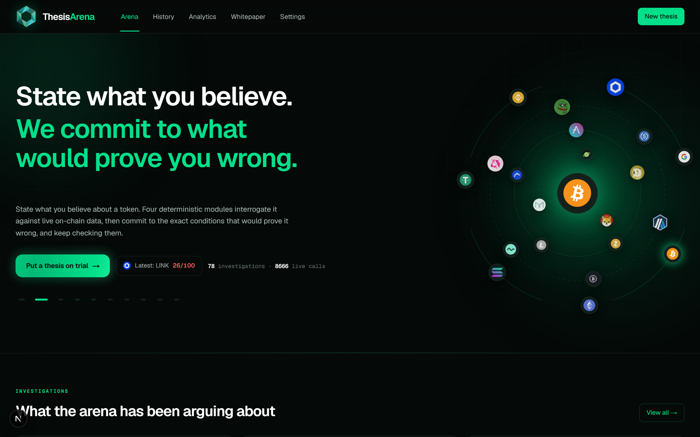
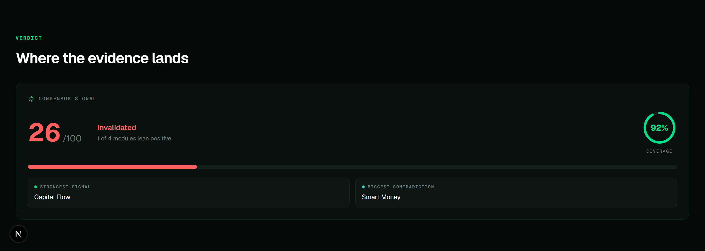
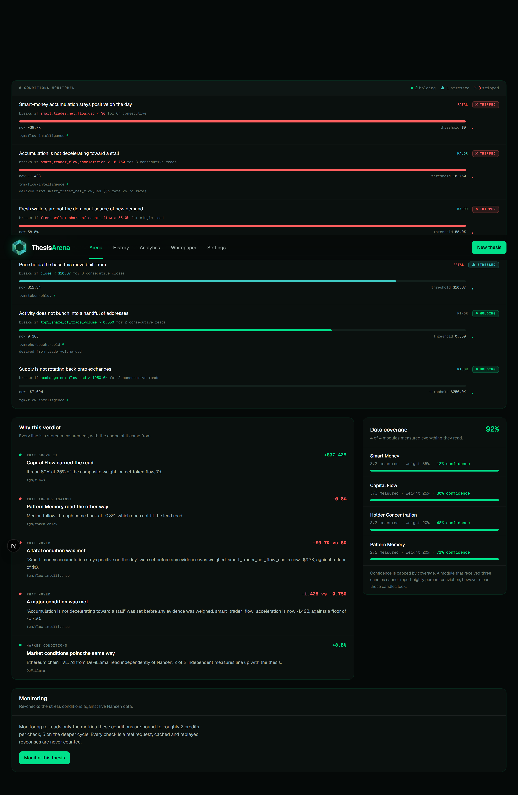
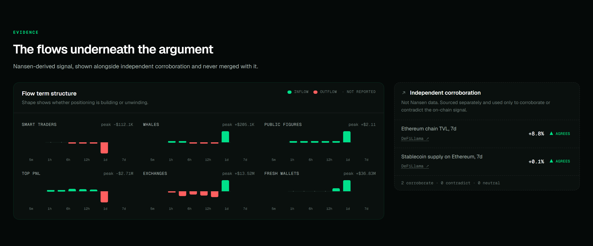
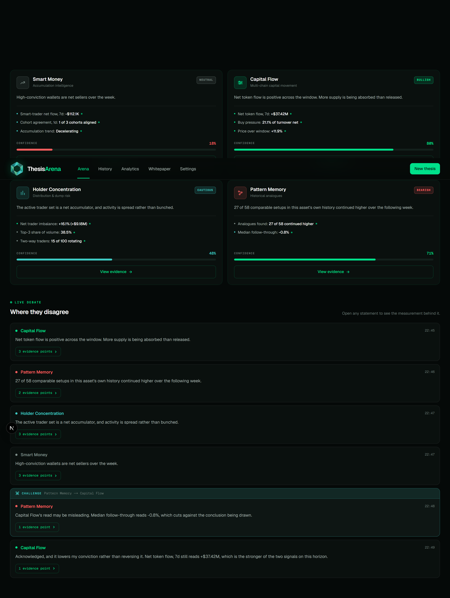
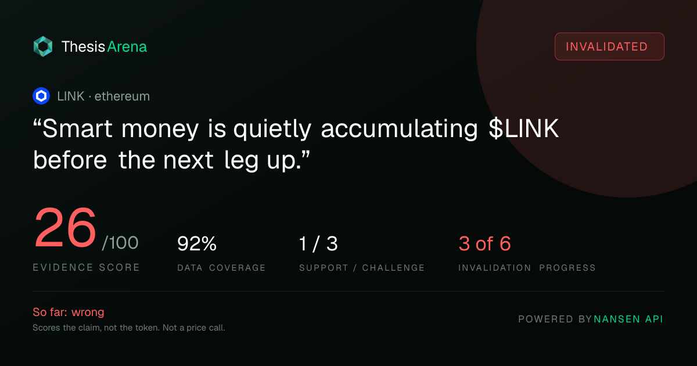
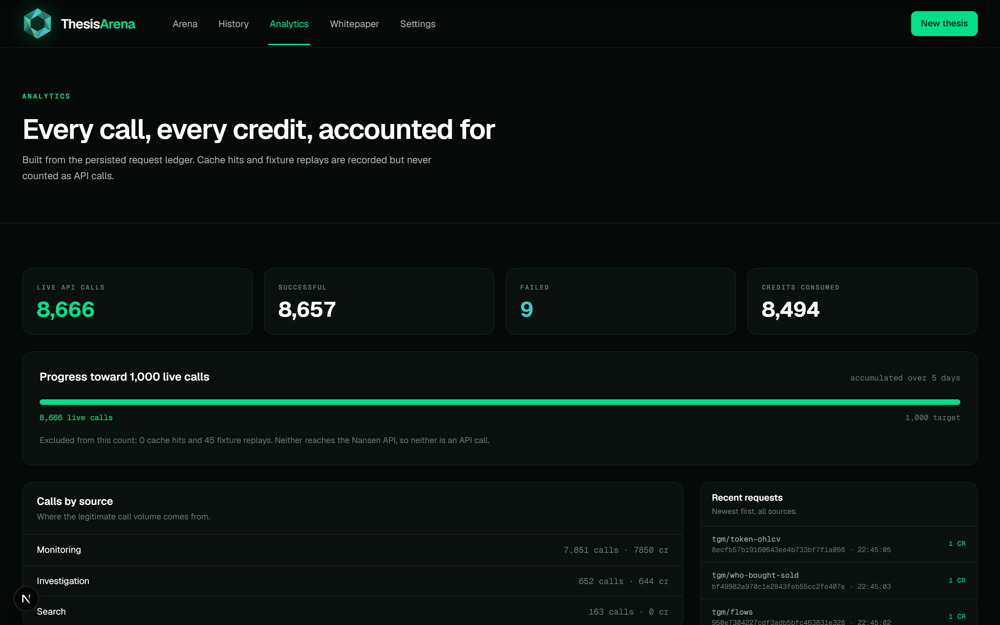
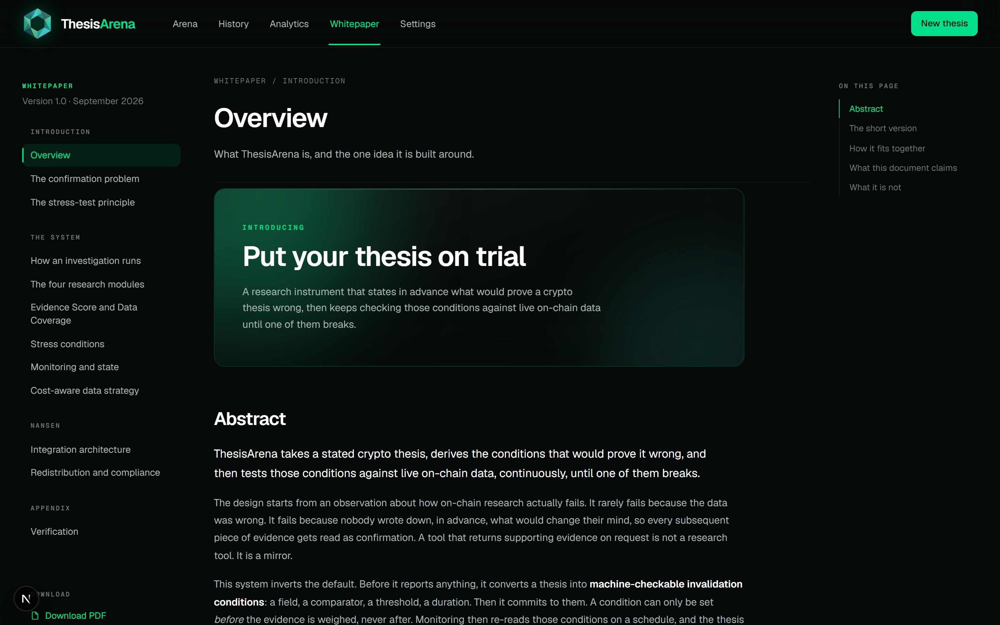
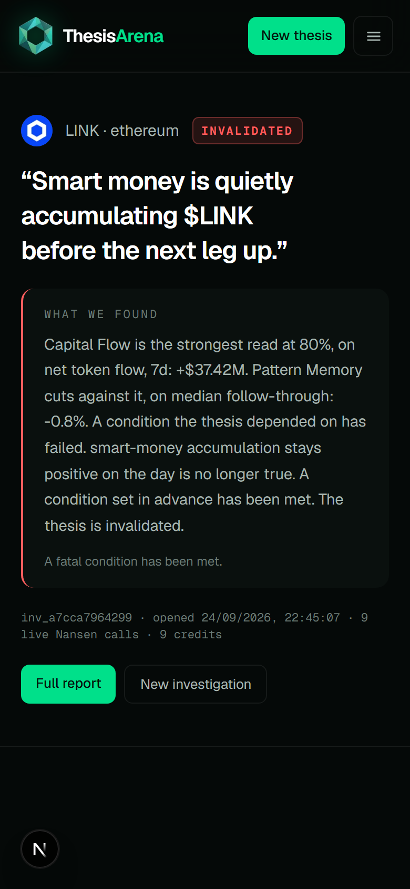

# ThesisArena

**Put your thesis on trial.**

Every other tool tells you why you're right. ThesisArena finds out if you are.

State what you believe about a token in plain language. Four deterministic research modules interrogate it against live Nansen data, commit to the exact conditions that would prove it wrong, and then keep checking those conditions until one of them breaks.



---

## The problem

Ask any on-chain analytics product about a token you already like and it will find you something encouraging. That is not dishonesty. It is the predictable result of an interface built around search: a dashboard offers dozens of metrics across many timeframes, you arrive with a prior, and somewhere in that space is a chart that agrees.

The failure is rarely bad data. It is that nobody writes down, in advance, what would change their mind. Without a committed invalidation level, no observation can ever count as disconfirming. It becomes noise, or early, or priced in.

The cost is not a bad entry. It is the absence of an exit.

## What this does instead

Before it reports anything, ThesisArena converts a thesis into **machine-checkable conditions**: a field, a comparator, a threshold, a duration. A condition can only be set *before* the evidence is weighed, never after. Monitoring then re-reads those conditions on a schedule, and the verdict moves on its own as real data arrives.



Two numbers, never merged: an **Evidence Score** for how strong and internally consistent the evidence is, and **Data Coverage** for how much data actually backed the read. A thin unanimous read and a deep unanimous read are not the same finding, and a single blended number renders them identically.

### Five states, all thesis-relative

| State | Meaning |
|---|---|
| `SUPPORTED` | Evidence supports the thesis and no decisive contradiction is present |
| `MIXED` | Evidence is split across the research modules |
| `UNDER PRESSURE` | One or more conditions show stress, but the thesis has not failed |
| `CHALLENGED` | The available evidence is materially contradicting the thesis |
| `INVALIDATED` | A fatal condition has been met |

Never bullish or bearish. A thesis can itself be bearish, so a directional verdict would read as a price forecast this system does not make. The only question answered is whether the claim is surviving its own conditions.

## Conditions, committed in advance



Six conditions per investigation, each bound to a specific endpoint and field, so re-checking is a lookup rather than an interpretation:

```ts
{
  claim:      "Smart-trader accumulation is sustained",
  metric:     { endpoint: "tgm/flow-intelligence",
                field:    "smart_trader_net_flow_usd",
                params:   { timeframe: "1d" } },
  comparator: "<",
  threshold:  0,
  sustain:    "6h consecutive",
  severity:   "fatal"
}
```

**Conditions are shaped by what you claimed.** A deterministic parser reads direction and mechanism from your sentence, and only the mechanism you actually named can be fatal. A claim that retail is buying is not invalidated because smart money went flat that day. This matters more than it sounds: a fixed template invalidates a retail-adoption thesis using the very evidence that supports it.

The checker contains **no model call**. That is what makes a verdict reproducible after the fact.

## The evidence underneath



Every investigation shows the full **flow term structure**: six wallet cohorts (smart traders, whales, public figures, top PnL, exchanges, fresh wallets) across six horizons each (5m, 1h, 6h, 12h, 1d, 7d). The shape is the signal. If the short end runs slower than the long end, accumulation is decelerating even while it remains positive, and that is invisible in any single-timeframe read.

Beside it, and never merged with it, sits independent corroboration from DeFiLlama, labelled *not Nansen data*.

## The four modules



| Module | Reads | Derives | Weight |
|---|---|---|---|
| **Smart Money** | `tgm/flow-intelligence` × 6 timeframes | Flow term structure, cohort agreement, acceleration | 35% |
| **Capital Flow** | `tgm/flows` | Net token movement, buy pressure as a share of turnover | 25% |
| **Holder Concentration** | `tgm/who-bought-sold` | Net USD imbalance, top-3 share of volume, rotating traders | 20% |
| **Pattern Memory** | `tgm/token-ohlcv` | Analogues in the asset's own history, strictly point-in-time | 20% |

They answer four different questions, which is the point. If they were four views of the same signal they would always agree, and a disagreement between them would be theatre. They also fail in different places: Smart Money goes blind on untracked tokens, Capital Flow refuses stablecoins and native assets, Concentration is skewed by a top-traders sample, Pattern Memory is useless on a token launched last week. Confidence is capped by coverage, and a degraded module says so on the page.

Every investigation ends with **why the verdict came out that way**: which module carried the weight, what argued against it, which conditions moved and by how much, and what the read could not see. Each line carries its figure and the endpoint that produced it.

## The result card



Every investigation renders a card at `/api/og/[id]`, generated server side from the stored verdict rather than from anything typed by hand. Share on X downloads the image and opens the composer with the caption already written, so the claim, the score, the coverage and the invalidation count travel together and cannot be quoted selectively.

It carries the two numbers unmerged, the support and challenge split, how many of the six conditions have broken, and a one-line verdict in plain words. In small type at the bottom: **Scores the claim, not the token. Not a price call.** That line is there because a number on a dark card next to a ticker looks like a price signal, and this one is not.

## Nansen integration

Every request goes through one client, so cost, budget, rate limiting and the ledger cannot be bypassed. There is no second path to the API, deliberately, because a parallel route would break the counting guarantee.

- **Endpoint registry.** Each endpoint carries its credit cost and its redistribution class. Costs vary by 500× across the surface (`tgm/flow-intelligence` is 1 credit, `profiler/address/labels` is 100, `agent/expert` is 750), so nothing is called without going through this table.
- **Tiered escalation.** The 1-credit tier always runs. The 5-credit tier runs only when the cheap tier is inconclusive. The 25-credit tier requires explicit opt-in. Endpoints that are prohibited for display or ruinously expensive **throw** rather than being merely avoided.
- **Record and replay.** A response is recorded once and replayed at zero credits thereafter.

An investigation costs about 9 credits. A monitoring check costs 2, and every sixth cycle costs 5. That is what makes continuous monitoring affordable, and monitoring is the product.

### Compliance

Nansen's terms permit derived analysis but prohibit republishing proprietary signals. Three things enforce that here as code paths rather than policy statements:

- Restricted-class data contributes only as a weighted term inside a composite. A render guard throws if a raw restricted value reaches the UI, and a test covers it.
- Every composite is combined with a substantial independent source, DeFiLlama, shown in its own panel and explicitly labelled.
- **Powered by Nansen API** appears in the footer and on every shareable card.

## The 1,000-call requirement



Call volume comes from real work: investigations users run, plus monitoring checks re-reading conditions committed to in advance across a portfolio of distinct theses.

**Only real network calls count.** The ledger records three sources, `live`, `cache` and `fixture`, and a database `CHECK` constraint enforces the distinction rather than leaving it to whoever writes the next query. Cache hits and fixture replays are shown on the analytics page and explicitly excluded, with the exclusion stated on the page itself.

```bash
npx tsx scripts/export-ledger.ts
# export/nansen-requests.csv   every live call with its Nansen request id
# export/usage-summary.json    totals, per-endpoint and per-context breakdown
```

`export/nansen-requests.csv` is committed. Every row carries the request id Nansen returned, so the ledger is checkable against Nansen's own records rather than taken on trust.

## Architecture

```
thesis (plain English)
      |  deterministic claim parser: direction + mechanism
      v
resolve ticker   Nansen search, spot contracts only, perps filtered out
      v
four modules, each on its own endpoint, no model calls
      v
weighted composite   Evidence Score + Data Coverage, combined with DeFiLlama
      v
six conditions committed BEFORE the verdict is shown
      v
monitoring re-reads those conditions on a schedule, bypassing cache
```

Three properties worth naming:

1. **No model runs in the research path.** Modules are arithmetic over API responses, conditions are typed objects, the checker is a comparator. The same inputs produce the same read, so a verdict can be re-derived and audited. The system cannot hallucinate a finding because nothing in the path can invent one.
2. **Conditions precede the verdict.** The ordering is the safeguard. A condition written after the score is known would be tuned, consciously or not, to a threshold the evidence already clears.
3. **State is derived, not stored.** The verdict is recomputed from the conditions and module stances on every read.

### Stack

Next.js 16 · React 19 · TypeScript · Tailwind 4 · Vitest · SQLite locally, Neon Postgres in production.

Persistence selects itself by environment. `DATABASE_URL` unset uses SQLite on local disk, so development needs no configuration. Set, it uses Postgres, which a hosted deployment requires because a serverless filesystem is ephemeral. `src/lib/db/sql.ts` reconciles the two so every caller above it reads the same shapes whichever backend is live.

## Running it

```bash
npm install
cp .env.example .env.local        # add your Nansen key
npm run dev
```

| Command | Does |
|---|---|
| `npm run dev` | The app on :3000 |
| `npm test` | 41 tests over the claim parser, conditions, scoring and formatting |
| `npx tsx --env-file=.env.local scripts/seed.ts 10` | Seed investigations and start monitoring |
| `npx tsx --env-file=.env.local scripts/scheduler.ts 60` | Run due monitoring checks |
| `npx tsx scripts/export-ledger.ts` | Export the API-usage evidence |
| `npx tsx scripts/audit-claims.ts` | Print how the parser reads every stored statement |
| `npx tsx --env-file=.env.local scripts/verify-postgres.ts` | 15-point production check against Neon |

### Routes

`/` arena · `/new` investigate · `/thesis/[id]` result and monitoring · `/report/[id]` full report · `/history` the permanent record · `/analytics` request ledger · `/settings` live configuration and compliance classes · `/whitepaper` the design document · `/whitepaper/full` one-page print view · `/api/og/[id]` share image

## Whitepaper



`/whitepaper` holds the full design document: the stress-test principle, the module set, the scoring model, the Nansen integration and its credit economics. Pages that quote the system's own figures read them out of the running instance rather than restating numbers that drift, and mark them **Live**.

It downloads as a PDF at `/thesisarena-whitepaper.pdf`, regenerated by `scripts/export-whitepaper.ts` from the same components the site renders, so the file cannot drift from the pages.

## On mobile



Audited at 320, 360, 375, 390, 393, 412, 430, 480, 768, 820, 834, 1024 and 1440px: zero horizontal overflow, zero text below 11px, zero touch targets under 28px, on every route and in every interactive state.

## Honest notes

- The **Evidence Score is not a probability** and not a price forecast. It measures the strength and consistency of on-chain evidence, nothing more. There is no path in the scoring code that would produce a probability.
- **Module weights (35/25/20/20), confidence caps and sustain windows are judgement, not calibration.** Nothing has been backtested to justify them over other reasonable values. They are defensible as reasoning; they are not defensible as results.
- **Pattern Memory's analogue matching is deliberately simple**: similar return and volatility profile over a seven-day window. Honest and computable from one cheap call, and not a rigorous statistical method. Read it as "this has looked like this before", not as a base rate.
- **There is no news, social or launch data in this system.** A reason is never "the token launched a product". The only market context available is chain TVL and stablecoin supply, read independently from DeFiLlama.
- `tgm/flows` rejects native tokens and stablecoins. Those investigations degrade to a cohort-level read and say so, but they are genuinely thinner.
- Cohort endpoints return top traders by volume, a biased sample of holders by construction. The modules are built to be robust to that, not to correct it.
- The 13 curated marks in `public/coins` are drawn approximations rather than official brand assets. Every other token logo is the real one, fetched through `/api/icon` and cached.
- **Research is limited to the chains Nansen's token-god-mode endpoints cover.** A ticker whose best listing sits on an unsupported chain (native Bitcoin, for example) resolves to a researchable contract on a supported chain instead, and the chain it actually read is shown on the result. It is not the same asset, and the page does not pretend otherwise.

## Verification

```bash
npx tsc --noEmit                          # types
npx eslint src scripts --max-warnings 0   # lint
npm test                                  # 41 tests
npm run build                             # production build
```

Several tests encode defects that reached the interface and were fixed: the score clamp that made every broken thesis score exactly 35, the status precedence that mislabelled contradicted theses, the perp-address filter, the negative-zero formatter, and the fixed-template conditions that invalidated a retail thesis using the evidence supporting it. A regression there is a regression in the product's honesty, not just its output.

---

*Research tool, not investment advice. Powered by Nansen API.*
